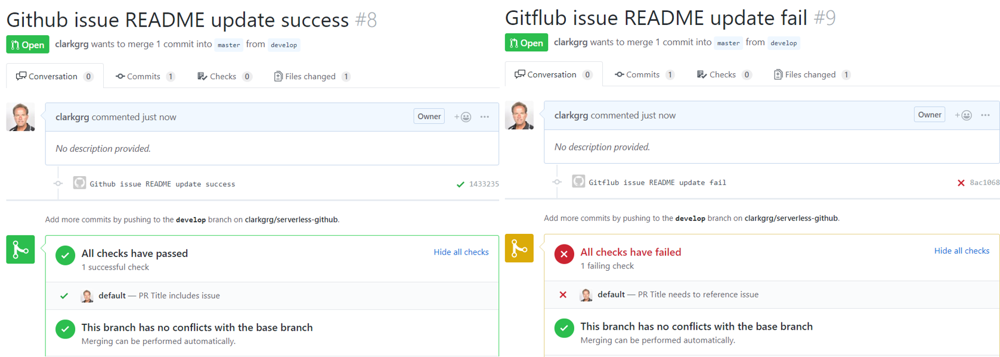

# Serverless Github checker

More fun from Serverless #noServerNovember challenge 3

Git in on the fun

## Use Case

This challenge adds a Github checker whenever a new PR is created
* Check that the PR title references 'GitHub issue xxxxxx'
* If PR title does not reference 'GitHub issue xxxxxx' then check fails

Picture below shows success and failure cases

